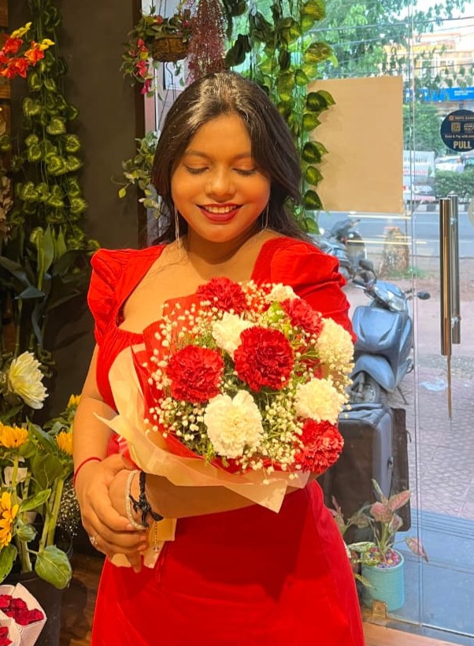

  <## 🎭 About This AI Wizard

- 🤖 **AI Intern** @ **ApanaGhr** | 🎓 **KIIT CSE '27** (CGPA: 8.52)
- 🧠 **Learning:** LLMs, RAG, BERT & Cloud Magic ✨
- 🏆 **MIT AI Hackathon** Top 10 | 🥇 **TechFrontier Winner**
- 💻 **Stack:** Python, JS, React, TensorFlow, OpenCV
- ☕ **Superpower:** Coffee → AI Models 🚀
- 🎯 **Co-founder** @ GrafikGalore | 📢 Campus Ambassador @ Unstop
- 📧 **Owl Mail:** 23052947@kiit.ac.in
- 🌐 **Portfolio:** [ankitarahi.xyz](https://www.ankitarahi.xyz) | [Vercel](https://ankita-jade.vercel.app)00%" src="https://capsule-render.vercel.app/api?type=waving&color=gradient&customColorList=6,11,20&height=200&section=header&text=Ankita%20Rahi&fontSize=50&fontColor=fff&animation=twinkling&fontAlignY=35&desc=✨%20AI/ML%20Enthusiast%20%7C%20Full-Stack%20Developer%20%7C%20KIIT%20CSE%20'27%20✨&descAlignY=55&descSize=20" />

  

  

  
  
  
  

  

---

## 🎭 About This AI Wizard

- 🤖 **AI Intern** @ **ApanaGhr** | 🎓 **KIIT CSE '27** (CGPA: 8.52)
- 🧠 **Learning:** LLMs, RAG, BERT & Cloud Magic ✨
- 🏆 **MIT AI Hackathon** Top 10 | 🥇 **TechFrontier Winner**
- � **Stack:** Python, JS, React, TensorFlow, OpenCV
- ☕ **Superpower:** Coffee → AI Models 🚀
- 🎯 **Co-founder** @ GrafikGalore | 📢 Campus Ambassador @ Unstop
- 📧 **Owl Mail:** 23052947@kiit.ac.in
- 🌐 **Portfolio:** [ankitarahi.xyz](https://www.ankitarahi.xyz) | [Vercel](https://ankita-jade.vercel.app)

  

---

## 😄 Fun Facts About Me

  

| 🎭 **Personality** | 🎯 **Fun Facts** |
|:---|:---|
| 🍕 **Pizza Debugger** | I debug code better with pizza nearby 🐛➡️✅ |
| 🌙 **Night Owl Coder** | My best algorithms come at 2 AM 🦉💻 |
| 🎵 **Code Beats** | Lo-fi hip hop = instant productivity boost 🎧📈 |
| 📚 **Bookworm** | AI papers > bedtime stories 📖🤖 |
| 🎮 **Gaming Geek** | Strategy games = training for system design 🎯🧠 |
| ☕ **Coffee Alchemist** | Converting caffeine into code since 2023 ⚗️💻 |
| 🌱 **Plant Parent** | My plants listen to my coding rants 🪴💬 |
| 🎨 **Creative Soul** | Design thinking meets machine learning 🎨🤖 |

  

---

## 🛠️ My Magical AI/ML Toolkit

  
  
  

### 💻 **Programming Languages That Speak to My Soul**

  
    
  

### 🤖 **AI/ML Arsenal**

  
  
  
  
  
  
    
  

### 🎨 **Frontend Artistry**

  
    
  

### ⚙️ **Backend Sorcery**

  
    
  

### 🗄️ **Data Kingdoms**

  
    
  

### 🔧 **Developer Weapons of Choice**

  

  

---

## 📊 My Coding Journey Stats

  
  
  

  
  

  

  

---

## 🏆 Achievement Unlocked! 

  
  
  

### 🥇 **MIT AI Hackathon 2025** - Top 10 Finalist (Global, 800+ teams)
### 🥇 **TechFrontier Industry 4.0 2024** - Winner (1st Prize)
### 🥈 **Smart India Hackathon 2024** - National Participant
### 🏆 **Multiple Hackathon Participations** with successful deliveries (2024-2025)

  

---

## 🚀 Featured AI/ML Projects

  
  
  

### 🥇 **ThinkForge** - Perplexity Hackathon 2025
🤖 **AI Debate Platform** with Historical Figures using **Sonar AI** and **React.js**
- Enables debates with AI-powered historical personalities
- Real-time argument analysis and scoring
- Technologies: React.js, Sonar AI, NLP

### 🥈 **HackaTwin** - MIT AI Hackathon 2025  
📊 **Hackathon Management System** with **FastAPI**, **Next.js**, and **Local LLM**
- Achieved 43% email open rate
- Automated participant management and communication
- Technologies: FastAPI, Next.js, LLM Integration

### 🥉 **Recora** - MIT AI Hackathon 2025 (Top 10 from 800+ teams)
🏥 **Privacy-First Health Assistant** using **LLMs** and **React**
- Secure health data processing with local AI
- HIPAA-compliant architecture
- Technologies: React, LLMs, Privacy Engineering

### 🎯 **Ninja Meeting AI** - Personal Project 2025
🎙️ **Real-time Meeting Transcription** using **RAG**, **BERT**, and **LLMs**
- Live meeting analysis and summarization
- Action item extraction and follow-up automation
- Technologies: RAG, BERT, LLMs, Real-time Processing

### 🛡️ **Women Safety Analytics** - Smart India Hackathon 2024
👁️ **CCTV-Integrated Anomaly Detection** using **AI/ML** and **OpenCV**
- Real-time threat detection and alert system
- Computer vision-based safety monitoring
- Technologies: OpenCV, TensorFlow, Computer Vision

### 🧠 **AI Mental Health Assistant** - TechFrontier 2024 (1st Prize Winner)
💙 **Sentiment-Aware Chatbot** using **Python** and **NLP**
- Emotion detection and personalized responses
- Mental health screening and support
- Technologies: Python, NLP, Sentiment Analysis

---

## 📈 My Coding Activity Universe

  
  
  

  

---

## 🐍 Watch My Contributions Get Eaten!

  
  
    
  <picture>
    <source media="(prefers-color-scheme: dark)" srcset="https://raw.githubusercontent.com/ankita1477/ankita1477/output/github-contribution-grid-snake-dark.svg">
    <source media="(prefers-color-scheme: light)" srcset="https://raw.githubusercontent.com/ankita1477/ankita1477/output/github-contribution-grid-snake.svg">
    
  </picture>
  
  <!-- Fallback animated contribution visualization -->
    
  

---

## 💼 Professional Experience

  
  
  

### 🤖 **AI Intern** - ApanaGhr (June 2025 - September 2025)
- Contributing to AI/ML projects in rental housing ecosystem
- Developing solutions using JavaScript, TypeScript, and Python
- Working on intelligent property matching algorithms

### 🎯 **Perplexity Campus Partner** - KIIT (2025)
- Promoting Comet Browser and building community engagement
- Leading innovation initiatives and AI tools awareness
- Organizing tech talks and workshops

### 🌐 **Campus Ambassador** - Unstop (2025-2026)
- Leading campus networking and collaboration initiatives
- Bringing opportunities and competitions to student community
- Building bridges between industry and academia

### 🎨 **Co-founder** - GrafikGalore (2023-Present)
- Managing e-commerce operations and customer relations
- Specialized in graphic design and custom products
- Building sustainable business with creative solutions

---

## 🎓 Education Journey

  

### 🏫 **KIIT University, Bhubaneswar** (2023-2027)
**Bachelor of Technology in Computer Science Engineering**
- **Current CGPA:** 8.52 (2nd Year), 8.75 (1st Year)
- **Focus Areas:** AI/ML, Full-Stack Development, System Design

### 📚 **Bethel Academy** (2020-2022)
- **Class XII (CBSE):** 79%
- **Class X (CBSE):** 79%

---

## 💭 Daily Dose of Developer Wisdom

  
  
    
  
  
    
  

---

## 🚀 Let's Connect & Create AI Magic Together!

  
  
    
  

  
  
  
  

  
  
  
  
  

   
  

---

## 🎉 Thanks for Visiting My AI Laboratory!

  &nbsp;&nbsp;&nbsp;&nbsp;&nbsp;&nbsp;
  
    
  

  

  

  
    
  🌟 <strong>Remember:</strong> Every AI breakthrough starts with a single line of code. Keep learning, keep building! 🌟

